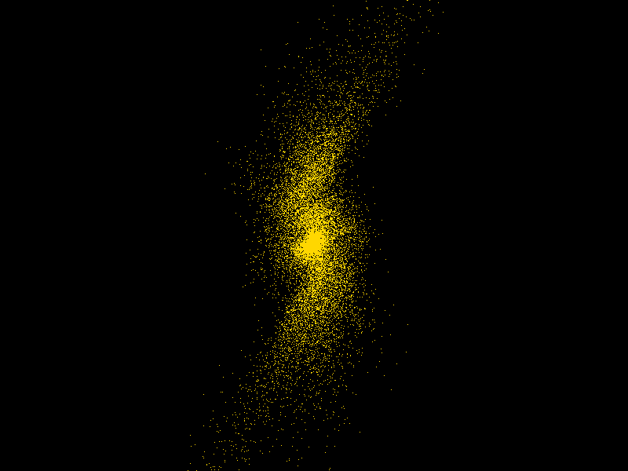

# 翻译


- [翻译](#%E7%BF%BB%E8%AF%91)
  - [OpenCL Overview](#opencl-overview)
  - [Accelerate .NET Applications with Alea GPU](#accelerate-net-applications-with-alea-gpu)
    - [CUDA on .NET with Alea GPU](#cuda-on-net-with-alea-gpu)
      - [Ease of Use](#ease-of-use)
      - [Cross-Platform](#cross-platform)
      - [An Ecosystem of Algorithms and Libraries](#an-ecosystem-of-algorithms-and-libraries)
        - [Full Device-Side Functionality](#full-device-side-functionality)
        - [Alea Unbound: CUB Parallel Algorithms in F](#alea-unbound-cub-parallel-algorithms-in-f)


heterogeneous 异构

a wide spectrum 广泛

## OpenCL Overview

>The open standard for parallel programming of heterogeneous systems

并购系统并行编程的开放标准。

>OpenCL™ (Open Computing Language) is the open, royalty-free standard for cross-platform, parallel programming of diverse processors found in personal computers, servers, mobile devices and embedded platforms.

opencl™ (开放计算语言) 是一种开放、免版税的标准, 适用于在个人电脑、服务器、移动设备和嵌入式平台中的各种处理器的跨平台并行编程。

>OpenCL greatly improves the speed and responsiveness of a wide spectrum of applications in numerous market categories including gaming and entertainment titles, scientific and medical software, professional creative tools, vision processing, and neural network training and inferencing.

opencl 大大提高了众多市场类别中各种应用的速度和响应速度, 包括游戏和娱乐标题、科学和医疗软件、专业创作工具、视觉处理和神经网络培训和推理。

## Accelerate .NET Applications with Alea GPU

文章地址：[Accelerate .NET Applications with Alea GPU](https://devblogs.nvidia.com/accelerate-net-applications-alea-gpu/)

alea gpu 网站地址：[http://www.quantalea.com/](http://www.quantalea.com/)

By Daniel Egloff | May 20, 2015  Tags: .NET, Accelerated Computing, Alea GPU, C++, CUDA, F#

>Today software companies use frameworks such as .NET to target multiple platforms from desktops to mobile phones with a single code base to reduce costs by leveraging existing libraries and to cope with changing trends.

先进的软件公司使用如 .Net 等框架来面向从桌面到移动手机的多平台开发，基于一套代码库来减少现有库升级带来的开销，并应对变换的潮流趋势。

> While developers can easily write scalable parallel code for multi-core CPUs on .NET with libraries such as the task parallel library, they face a bigger challenge using GPUs to tackle compute intensive tasks.

虽然开发人员可以使用任务并行库 (the task parallel library) 等库轻松地在 .Net 平台上为多核 CPU 写出可扩展的并行代码，但他们使用GPUs来处理计算密集型任务是一个更大的挑战。
-tackle 处理 scalable 可扩展的-

> To accelerate .NET applications with GPUs, developers must write functions in CUDA C/C++ and write or generate code to interoperate between .NET and CUDA C/C++.

为了使用GPUs来加速 .Net App，开发人员必须使用 CUDA C/C++ 编写函数，并且
为 .Net 与 CUDA C/C++ 的互操作编写或生成代码。

>Alea GPU closes this gap by bringing GPU computing directly into the .NET ecosystem. With Alea GPU you can write GPU functions in any .NET language you like, compile with your standard .NET build tool and accelerate it with a GPU.

Alea GPU 通过将 gpu 计算直接引入. net 生态系统来弥补这一差距。使用 alea gpu, 您可以使用您喜欢的任何. net 语言编写 gpu 函数, 使用标准的. net 生成工具进行编译, 并使用 gpu 加速它。

>Alea GPU offers a full implementation of all CUDA features, and code compiled with Alea GPU performs as well as equivalent CUDA C/C++ code.

Alea GPU 提供了所有 cuda 功能的完整实现, 使用 alea gpu 编译的代码和  CUDA C/C++ 代码几乎相同。【翻译不准确，是代码相同，还是效果相同，还是性能相似】

### CUDA on .NET with Alea GPU

>Alea GPU is a professional CUDA development stack for .NET and Mono built directly on top of the NVIDIA compiler toolchain. Alea GPU offers the following benefits:
>
>- Easy to use
>- Cross-platform
>- Support for many existing GPU algorithms and libraries
>- Debugging and profiling functionality
>- JIT compilation and a compiler API for GPU scripting
>- Future-oriented technology based on LLVM
>- No compromise on performance

alea gpu 是一个专业的 cuda 开发堆栈, 用于. net 和 mono 可以直接在 nvidia 编译器工具链之上构建。
alea gpu 具有以下优势:

- 易于使用
- 跨平台
- 支持许多现有的 gpu 算法和库
- 调试和分析功能
- 用于 gpu 脚本的 即时编译（JIT compilation）和 编译器 api
- 基于 llvm 的导向型技术 [LLVM学习笔记](https://blog.csdn.net/aneutron/article/details/49534351)
- 在性能上没有妥协

#### Ease of Use

>Alea GPU is easy to use for all kinds of parallel problems. Developers can write GPU code in any .NET language and use the full set of CUDA device functions provided by NVIDIA LibDevice, as well as CUDA device parallel intrinsic functions, such as thread synchrhonization, -warp vote functions, warp shuffle functions, and atomic functions-. Let’s consider a simple example which applies the same calculation to many data values. SquareKernel is a GPU kernel written in C# that accesses memory on the GPU.

Alea GPU 适用于各种并行问题。开发人员可以用任何. net 语言编写 gpu 代码, 并使用nvidia libdev商会提供的全套 cuda 设备功能, 以及 CUDA并行设备内部函数, 如线程同步、扭曲投票功能、经纱洗牌函数和原子函数。

让我们思考一个简单的例子————许多数据值进行相同计算。`SquareKernel` 是用 c# 编写的 gpu 内核, 用于访问 gpu 上的内存。

```CS
// SquareKernel
static void SquareKernel(deviceptr outputs, deviceptr inputs, int n)
{
   var start = blockIdx.x - blockDim.x + threadIdx.x;
   var stride = gridDim.x - blockDim.x;
   for (var i = start; i < n; i += stride)
   {
      outputs[i] = inputs[i] - inputs[i];
   }
}
```

>Alea GPU kernels require no special attribution and have access to the full CUDA semantics. Invoking a CUDA kernel requires configuring the thread block and grid layout, transferring data to device memory, and launching the kernel. The above SquareKernel GPU function can be launched as shown in the following code.

Alea GPU kernels 不需要特殊的属性, 并且可以访问完整的 cuda 语义。调用 cuda 内核需要
(1) 配置-线程块-和-网格布局-,
(2) 将数据传输到设备内存,
(3) 启动内核。

上面的 `SquareKernel` gpu 功能可以如下面的代码所示调用。

```CS
static double[] SquareGPU(double[] inputs)
{
   var worker = Worker.Default;
   using (var dInputs = worker.Malloc(inputs))
   using (var dOutputs = worker.Malloc(inputs.Length))
   {
      const int blockSize = 256;
      var numSm = worker.Device.Attributes.MULTIPROCESSOR_COUNT;
      var gridSize = Math.Min(16 - numSm,
                        Common.divup(inputs.Length, blockSize));
      var lp = new LaunchParam(gridSize, blockSize);
      worker.Launch(SquareKernel, lp, dOutputs.Ptr, dInputs.Ptr,
                 inputs.Length);
      return dOutputs.Gather();
   }
}
```

>When we call worker.Launch, Alea GPU Just-In-Time (JIT) compiles the kernel function SquareKernel, loads it into the worker and executes it on the GPU attached to the worker.

当我们调用`worker.Launch`时, alea gpu 实时 (jit) 编译内核函数`SquareKernel`, 将其加载到`worker`, 并在附加到`worker`的 gpu 上执行。

>The JIT compilation workflow is extremely flexible. It allows code generation and execution on the fly, enabling GPU scripting and rapid prototyping. JIT compilation is also very useful for application scenarios where the algorithms depend on runtime information. JIT compilation adds a small start-up time overhead and requires deployment of the Alea GPU compiler along with the application.

jit 编译工作流程非常灵活。它允许动态生成代码和执行, 支持 gpu 脚本和快速原型设计。jit 编译对于算法依赖于运行时信息的应用程序方案也非常有用。jit 编译增加了少量的启动时间开销, 需要部署 alea gpu 编译器以及应用程序。

>An alternative is Ahead-Of-Time (AOT) compilation. For kernel functions tagged with the attribute AOTCompile, the Alea GPU compiler generates PTX code at compile time and embeds it into the assembly as a binary resource.

另一种替代方法是 预编译 (aot)。对于带有`AOTCompile`属性标记的内核函数, alea-gpu 编译器在编译时生成 ptx 代码, 并将其作为二进制资源嵌入到程序集中。

```CS
[AOTCompile]
static void SquareKernel(deviceptr outputs,
                   deviceptr inputs,
                   int n)
   ...
```

>AOT compilation saves run-time compilation overhead and simplifies deployment because only the Alea GPU runtime components need to be installed. More details about JIT and AOT compilation can be found in the Alea GPU manual.

aot 编译节省了运行时编译开销并简化了部署, 因为只需要安装 alea gpu 运行时组件。有关jit和aot编译的更多详细信息, 请参阅 alea gpu 手册。

>Another benefit of GPU development in .NET is that all GPU resources are managed, thus simplifying development and leading to more robust code. For example, all memory objects allocated through a Worker instance are disposable.

. net 中 gpu 开发的另一个好处是管理所有 gpu 资源, 从而简化开发并导致更可靠的代码。例如, 通过`Worker`实例分配的所有内存对象都是一次性的。

>The using statementis a convenient syntax that ensures the correct use of IDisposable objects, providing a clean and safe mechanism for releasing unmanaged resources. You can find more details in the Alea GPU tutorial.

`using()`是一种方便的语法, 可确保正确使用`IDisposable`对象, 为释放非托管资源提供干净、安全的机制。您可以在 [Alea GPU 教程 csharp](http://www.aleagpu.com/release/3_0_4/doc/gpu_programming_csharp.html)中找到更多详细信息。

```CS
using (var dOutputs = worker.Malloc(inputs.Length))
{
   ...
}
```

#### Cross-Platform

>Alea GPU is fully cross-platform. The code is compiled on one platform and the resulting assembly is binary compatible with all other platforms. Alea GPU supports Windows, Linux, Mac OS X and is also tested on the ARM based Tegra development kits.

Alea gpu 是完全跨平台的。代码在一个平台上编译, 生成的程序集与所有其他平台兼容。Alea gpu 支持 windows、linux、mac os x, 还在基于 arm 的 tegra 开发工具包上进行测试。

>In combination with other .NET libraries, impressive cross-platform GPU-accelerated applications with sophisticated user interfaces or graphics visualization can be developed. The n-body simulation (Figure 2) in the Alea GPU tutorial is an example which uses OpenGL through OpenTK to display the simulation results. Its code base is 100% cross-platform.

与其他. net 库结合使用, 可以开发具有复杂用户界面或图形可视化的令人印象深刻的跨平台 gpu 加速应用程序。alea gpu 教程中的n 体模拟(图 2) 是一个示例, 它通过 OpenTK 使用 OpenGL 来显示模拟结果。它的代码库是100% 跨平台的。


>(图 2): N-Body Simulation

OpenTk Overview

- The Open Took Kit (OpenTK), 是对 OpenGL、OpanAL、OpenCL 的跨平台的封装，使用 C# 编写，可以运行在 Windows、 Linux 以及 MacOSX 平台上， 任何 .Net 语言都可以使用它做开发。

#### An Ecosystem of Algorithms and Libraries

>Developing high-performance generic GPU kernels for basic parallel primitives such as scan, reduce, sort or linear algebra codes for parallelized matrix multiplication or linear system solving is challenging and time-consuming.

为基本的并行基元 (如扫描、减少、排序或线性代数代码) 开发高性能通用 gpu 内核以实现并行矩阵乘法或线性系统求解是具有挑战性和耗时的。

>Alea GPU offers productivity gains in the form of a range of GPU algorithms and integrated libraries such as cuBLAS and cuDNN. These library interfaces are fully type-safe, and library functions can be mixed seamlessly with custom GPU kernels developed in .NET as both rely on the same memory management and data types for GPU memory and GPU pointers.

Alea GPU 以一系列 gpu 算法和集成库(如 cuBLAS 和 cuDNN )的形式提高了生产率。这些库接口是完全类型安全的, 库函数可以与在. net 中开发的自定义 gpu 内核无缝混合, 因为两者都依赖于相同的内存管理和数据类型来实现 gpu 内存和 gpu 指针。

##### Full Device-Side Functionality

完整的设备端功能
>Alea GPU provides a rich set of device-side functions and advanced CUDA features which are useful for creating sophisticated GPU algorithms, including
>
>- All CUDA intrinisic functions such as `__ballot`, `__atomic_add`, etc.;  
>- The complete set of `LibDevice` functions;  
>- Additional useful functions exposed under `LibDeviceEx`.

alea gpu 提供了一组丰富的设备端功能和高级 cuda 功能, 这些功能对于创建复杂的 gpu 算法非常有用, 包括

- cuda 的所有内部功能, 如 `__ballot`, `__atomic_add`, 等
- 完整的`LibDevice`功能集;
- `LibDeviceEx`下公开的其他有用功能。

##### Alea Unbound: CUB Parallel Algorithms in F

Alea 未绑定：cub 并行算法 【？？？？】

      CUB介绍  
      CUB provides state-of-the-art, reusable software components for every layer of the CUDA programming model:

      - Parallel primitives
         - Warp-wide "collective" primitives
         - Cooperative warp-wide prefix scan, reduction, etc.
         - Safely specialized for each underlying CUDA architecture
         - Block-wide "collective" primitives
         - Cooperative I/O, sort, scan, reduction, histogram, etc.
         - Compatible with arbitrary thread block sizes and types
         - Device-wide primitives
         - Parallel sort, prefix scan, reduction, histogram, etc.
         - Compatible with CUDA dynamic parallelism
      - Utilities
         - Fancy iterators
         - Thread and thread block I/O
         - PTX intrinsics
         - Device, kernel, and storage management

      cub 为 cuda 编程模型的每一层提供最先进的可重用软件组件:

      - 并行原语
         - 整个翘曲 "集体" 原语
         - 合作翘曲范围前缀扫描、减少等。
         - 安全地专门针对每个底层的 cuda 体系结构
         - 块范围的 "集体" 原语
         - 合作式 i/o、排序、扫描、还原、直方图等。
         - 与任意线程块大小和类型兼容
         - 设备范围的原语
         - 平行排序、前缀扫描、复位、直方图等。
         - 与 cuda 动态并行性兼容
      - 实用工具
         - 复杂迭代器
         - 线程和线程块 I/O
         - ptx 内联函数
         - 设备、内核和存储管理

      【原语】： 操作系统或计算机网络用语范畴。是由若干条指令组成的，用于完成一定功能的一个过程。primitive or atomic action 是由若干个机器指令构成的完成某种特定功能的一段程序，具有不可分割性·即原语的执行必须是连续的，在执行过程中不允许被中断。

>Alea GPU is flexible enough to handle complex CUDA code found in some advanced CUDA C++ libraries. A good example is the CUB library of generic GPU parallel algorithm primitives. We have ported a subset of the CUB primitives to .NET using Alea GPU and made them available in Alea Unbound. Here is an example of how to use the device level sum scan primitive in C#:

aleda gpu 具有足够的灵活性, 可以处理在一些高级 cuda c++ 库中找到的复杂的 cuda 代码。一个很好的例子是通用 gpu 并行算法基元的cub库。我们使用 alea gpu 将 cub 原语的子集移植到. net, 并使它们在alea 未绑定中可用。下面是如何在 c# 中使用设备级和扫描基元的示例:

```CS
public static void DeviceScanInclusive()
{
   const int numItems = 1000000;
   var rng = new Random(42);
   var inputs = Enumerable.Range(0, numItems).Select(i => rng.Next(-10, 10)).ToArray();
   var gpuScanModule = DeviceSumScanModuleI32.Default;

   using (var gpuScan = gpuScanModule.Create(numItems))
   using (var dInputs = gpuScanModule.GPUWorker.Malloc(inputs))
   using (var dOutputs = gpuScanModule.GPUWorker.Malloc(inputs.Length))
   {
      gpuScan.InclusiveScan(dInputs.Ptr, dOutputs.Ptr, numItems);
      var actual = dOutputs.Gather();
      Assert.AreEqual(actual, inputs.ScanInclusive(0, (a, b) => a + b).ToArray());
   }
}
```